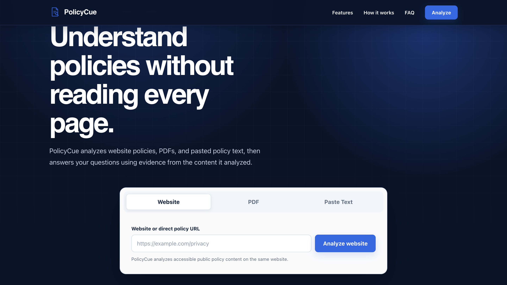
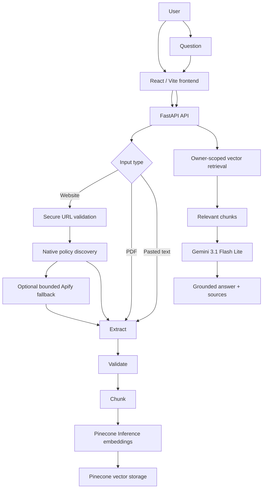
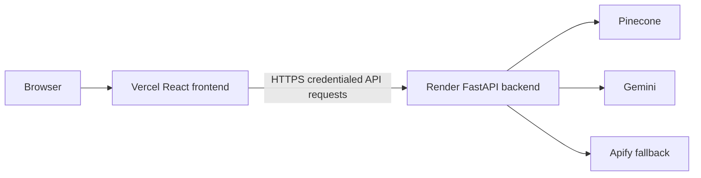

<div align="center">

# PolicyCue

### Ask policies. Get grounded answers.

AI-powered RAG document analysis for websites, PDFs, and pasted policy text with grounded answers and source citations.

[](https://policycue.vercel.app)


</div>

## Table of contents

- [Overview](#overview)
- [Product inputs](#product-inputs)
- [Key features](#key-features)
- [Screenshots](#screenshots)
- [How PolicyCue works](#how-policycue-works)
- [RAG pipeline](#rag-pipeline)
- [Website policy discovery](#website-policy-discovery)
- [Supported policy categories](#supported-policy-categories)
- [Security and privacy](#security-and-privacy)
- [Tech stack](#tech-stack)
- [Architecture](#architecture)
- [API](#api)
- [Local development](#local-development)
- [Environment configuration](#environment-configuration)
- [Testing](#testing)
- [Project structure](#project-structure)
- [Design decisions](#design-decisions)
- [V1 limitations](#v1-limitations)
- [Roadmap](#roadmap)
- [Author](#author)
- [License](#license)

## Overview

Policies and legal documents are long, fragmented, and difficult to navigate. PolicyCue lets users provide a website, PDF, or pasted policy text, then ask natural-language questions about the material. It retrieves relevant evidence and returns grounded answers with source references when the evidence supports one.

PolicyCue is not legal advice and does not claim complete coverage of a website's policies.

## Product inputs

1. **Website URL** — analyze a homepage or direct policy URL with automatic policy discovery.
2. **PDF** — upload a policy document for extraction and question answering.
3. **Pasted text** — analyze policy text directly in the browser workflow.

## Key features

- Retrieval-augmented grounded Q&A with source attribution
- Automatic website policy discovery and direct policy URL ingestion
- PDF and pasted-text analysis
- Classification across 16 policy categories
- Exact abstention when an answer is unsupported
- Secure anonymous document ownership and owner-scoped deletion
- Responsive React workspace
- Optional bounded Apify fallback for materially blocked policy pages

Discovery is best-effort and bounded; PolicyCue does not guarantee that every policy page on a website is found.

## Screenshots

<p align="center">
  
</p>

<p align="center">
  <em>PolicyCue — analyze website policies, PDFs, and pasted text with grounded AI answers.</em>
</p>

## How PolicyCue works



## RAG pipeline

1. **Acquire** website, PDF, or pasted text.
2. **Validate** URLs and candidate policy content.
3. **Extract** readable text and source metadata.
4. **Chunk** text with `RecursiveCharacterTextSplitter`.
5. **Embed** passages using Pinecone Inference.
6. **Store** vectors with document and owner metadata.
7. **Retrieve** owner-scoped relevant chunks for a question.
8. **Generate** a grounded structured response.
9. **Cite or abstain**: supported answers include source attributions; unsupported questions receive the fixed abstention response.

### Chunking

- `RecursiveCharacterTextSplitter`
- Chunk size: `1200`
- Overlap: `200`

### Embeddings

- Pinecone Inference
- `llama-text-embed-v2`
- Dimension: `768`
- Passage and query input modes

### Generation

- Gemini 3.1 Flash Lite
- Structured `answerable` / `answer` decision
- Temperature: `0`
- Unsupported questions return: `I could not find that information in the provided document.`

Gemini is used for generation; Pinecone Inference creates embeddings.

## Website policy discovery

Website acquisition is designed for useful recall while remaining bounded:

- Homepage, navigation, and footer policy links
- `robots.txt` sitemap declarations
- `sitemap.xml` and sitemap indexes
- Bounded shallow discovery of legal, help, support, policies, and about pages
- Common legal-policy path probing
- Policy-content classification and content-fingerprint deduplication
- Optional Apify `website-content-crawler` fallback for material blocked candidates

Fallback is optional and bounded. Discovery can be incomplete when sites are blocked, challenged, unavailable, or omit discoverable policy links.

## Supported policy categories

- Privacy Policy
- Terms of Service / Use / Conditions
- Community Guidelines
- Cookie Policy
- Data Processing Agreement
- AI Policy
- Content Policy
- Safety Policy
- Refund / Return Policy
- User Agreement
- Shipping / Delivery Policy
- Pricing / Payment Terms
- Acceptable Use Policy
- Accessibility Statement
- Disclaimer
- DMCA / Copyright Notice

## Security and privacy

- SSRF-resistant URL validation for HTTP/HTTPS inputs
- DNS and IP validation with local, private, reserved, and multicast address rejection
- Redirect validation, response/content limits, and bounded discovery
- Signed anonymous owner sessions with HttpOnly cookies and Secure production cookies
- Pinecone filtering by both `owner_id` and `document_id`
- Explicit credentialed CORS allowlist and production Origin protection for state-changing API requests
- Ingestion and ask rate limits; PDF and pasted-content limits
- Prompt-injection defense: document content is untrusted evidence, never instructions
- Server-side secrets; `VITE_*` variables contain no server credentials
- Owner-scoped deletion and partial-write cleanup

PolicyCue does not claim formal security certification.

## Tech stack

| Technology | Role |
| --- | --- |
| React 19, TypeScript, Vite | Frontend application |
| Motion | UI animation |
| Fetch API | Credentialed API requests |
| Vitest, React Testing Library, Oxlint | Frontend testing and linting |
| Python 3.13, FastAPI, Uvicorn | Backend API |
| Pydantic, Pydantic Settings | Request and configuration validation |
| HTTPX, Beautiful Soup | Secure website acquisition and parsing |
| PyPDF | PDF processing |
| LangChain RecursiveCharacterTextSplitter | Text chunking |
| Pytest | Backend testing |
| Gemini 3.1 Flash Lite, Google Gen AI SDK | Grounded answer generation |
| Pinecone Inference, `llama-text-embed-v2` | Passage and query embeddings |
| Pinecone Vector Database | Owner-scoped vector storage and retrieval |
| Apify website-content-crawler | Optional bounded fallback acquisition |
| Vercel | Frontend deployment |
| Render | Backend deployment |

## Architecture



The deployment diagram reflects the deployed architecture; deployment manifests are not stored in this repository.

## API

| Method | Endpoint | Purpose |
| --- | --- | --- |
| `GET` | `/health` | Health check. |
| `POST` | `/api/v1/ingest/url` | Discover, validate, and ingest website policy content. |
| `POST` | `/api/v1/ingest/text` | Ingest pasted policy text. |
| `POST` | `/api/v1/ingest/pdf` | Ingest a PDF policy document. |
| `POST` | `/api/v1/ask` | Return a grounded answer from owner-scoped retrieval. |
| `DELETE` | `/api/v1/documents/{document_id}` | Delete vectors for the active owner/document pair. |

## Local development

```bash
# From the repository root
python3 -m venv .venv
source .venv/bin/activate
pip install -r backend/requirements.txt
cp .env.example .env
PYTHONPATH=. python -m uvicorn backend.app.main:app --host localhost --port 8001
```

```bash
# In another terminal
cd frontend
npm install
cp .env.example .env
npm run dev
```

Use the environment templates and supply your own server-side credentials locally. Never commit `.env` files.

## Environment configuration

Backend variables:

```text
APP_ENV
SECRET_KEY
PINECONE_API_KEY
PINECONE_INDEX_NAME
PINECONE_EMBEDDING_MODEL
PINECONE_EMBEDDING_DIMENSION
GEMINI_API_KEY
GEMINI_MODEL
APIFY_API_TOKEN
CORS_ALLOWED_ORIGINS
SESSION_COOKIE_SAMESITE
```

Additional rate-limit and retry settings are documented in [`.env.example`](.env.example).

Frontend variables:

```text
VITE_API_BASE_URL
VITE_SITE_URL
```

Never place Gemini, Pinecone, Apify, `SECRET_KEY`, or any other server credential in `VITE_*` variables.

## Testing

Backend: **247 tests passing**

```bash
PATH="$PWD/.venv/bin:$PATH" PYTHONPATH=. python -m pytest backend/tests -q
```

Frontend: **30 tests passing**

```bash
cd frontend
npm test
npm run lint
npm run build
```

Tests cover ingestion, retrieval, ownership, security boundaries, RAG behavior, deletion lifecycle, CORS and production configuration, and frontend workflows. They do not claim 100% coverage.

## Project structure

```text
backend/
  app/
    analysis/
    api/
    core/
    ingestion/
    models/
    retrieval/
    services/
    main.py
  tests/
frontend/
  public/
  src/
    api/
    test/
    App.tsx
  package.json
.env.example
README.md
LICENSE
```

## Design decisions

- V1 has no database or user accounts; it uses signed anonymous owner isolation.
- It intentionally avoids Redis, Celery, and background queues.
- Website acquisition is bounded instead of an unrestricted crawler.
- Unsupported questions abstain rather than hallucinate.
- Secrets remain backend-only.
- The document lifecycle uses explicit owner-scoped deletion.

## V1 limitations

- Website discovery is bounded and best-effort.
- Blocked or challenged websites may require Apify fallback or may fail.
- There are no user accounts or document history.
- Access ownership depends on the anonymous browser session.
- There is no automatic TTL or background document cleanup.
- In-memory rate limiting is process-local.
- Cross-site cookies can be affected by browser privacy settings.
- PolicyCue does not provide legal advice or guarantee completeness.

## Roadmap

Future possibilities, not commitments:

- Durable document expiration and cleanup
- Optional accounts and history
- Improved retrieval and reranking
- Browser extension support
- Richer policy comparison

## Author

**Muhammad Zohaib**<br>
GitHub: [@Zohaib-mzb](https://github.com/Zohaib-mzb)

Built as a production-style portfolio project focused on secure document ingestion, retrieval-augmented generation, grounded AI responses, and real-world deployment.

## License

Copyright © 2026 Muhammad Zohaib. All Rights Reserved.

Source code is publicly visible for portfolio and evaluation purposes. Reuse, redistribution, modification, deployment, or commercial/non-commercial use is not granted without prior written permission. See [LICENSE](LICENSE).

## RAG Evaluation

PolicyCue includes an isolated, opt-in evaluation runner in `backend/evaluation/`.
A fixed, version-controlled benchmark makes regressions comparable without changing
production retrieval, prompts, models, chunking, API contracts, or frontend behavior.
The included **PolicyCue Eval v1 controlled benchmark** contains 50 questions over six
fixed synthetic policy documents (38 answerable, 12 unanswerable). It is not representative
of all real-world policy documents; no benchmark scores are published here.

Install evaluation dependencies in a separate environment, from the repository root:

```bash
python3 -m venv .venv-evaluation
.venv-evaluation/bin/python -m pip install -r backend/requirements.txt -r backend/requirements-evaluation.txt

# Offline: validate the dataset and print the real chunks for label review.
PYTHONPATH=. .venv-evaluation/bin/python -m backend.evaluation.evaluator --validate-only

# Live, explicitly opt-in: uses existing .env Gemini/Pinecone credentials and incurs API usage.
PYTHONPATH=. .venv-evaluation/bin/python -m backend.evaluation.evaluator \
  --dataset backend/evaluation/dataset.json --k 5

# Offline unit tests (no external service calls).
PYTHONPATH=. .venv-evaluation/bin/python -m pytest backend/evaluation/tests -q
```

`--skip-ragas` disables the semantic judge but **still uses live Pinecone embeddings,
retrieval, and Gemini answer generation**. `--judge-model` overrides the judge model;
the default is the existing `GEMINI_MODEL`. `--output-dir` selects the report directory.
RAGAS is optional and never imported by FastAPI. Its own package requires OpenAI and
LangChain integrations transitively; the runner creates no OpenAI client and requires
no OpenAI key or additional service. See [evaluation notes](backend/evaluation/README.md)
for API compatibility, dataset labeling, scope safety, and metric eligibility.

| Metric | Meaning |
| --- | --- |
| Recall@k | Distinct labeled relevant chunks retrieved / all labeled relevant chunks. |
| Precision@k | Distinct labeled relevant chunks retrieved / k, including when fewer results return. |
| RR / MRR | Reciprocal rank of the first relevant chunk in top-k; MRR averages eligible examples. |
| Faithfulness | RAGAS `Faithfulness`: generated claims supported by retrieved contexts. |
| Answer Relevancy | RAGAS `AnswerRelevancy`: generated-question similarity to the actual question, using production Pinecone query embeddings. |
| Context Relevancy | RAGAS `ContextPrecision`: rank-sensitive precision of contexts judged useful against the reference answer; a proxy, not the removed legacy context-relevancy metric. |
| Citation Correctness | Fraction of distinct reported source chunks in the labeled relevant evidence set. Also records supporting-citation coverage and incorrect/missing evidence counts. |
| Abstention Accuracy | Whether the actual answer/fallback matches `should_answer`, with separate answerable/unanswerable accuracies and four confusion counts. |

Retrieval metrics exclude examples with no relevant evidence labels. Semantic metrics
use actual pipeline outputs; unsupported responses are excluded from faithfulness and
answer relevancy, while reference-based context precision remains eligible for an
answerable question even if generation abstained. JSON reports contain every example's
ordered contexts, source metadata, answers, metric eligibility/error status, sample
counts, benchmark hash/version, model/package versions, and cleanup outcomes. Terminal
summaries show actual computed values or N/A; nulls are never averaged as zeros.
LLM-judge metrics can vary slightly. Scores only describe the labeled benchmark/version
used, and failed/incomplete runs must not be compared as complete benchmark runs.
